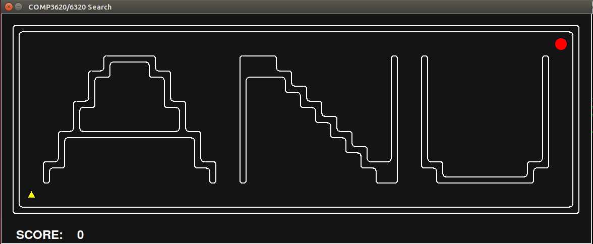
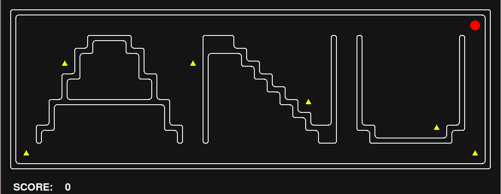
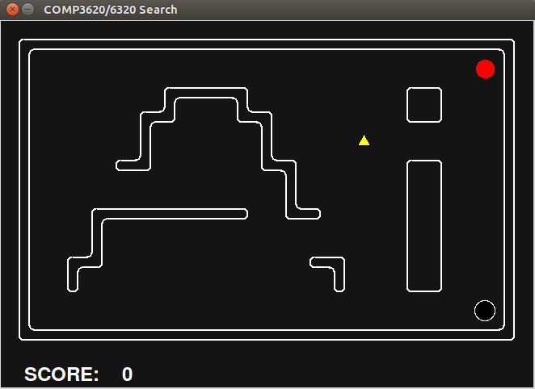

# Getting Started

Contents:

1. [Getting to the yellow bird ASAP](#Getting to the yellow bird ASAP)
2. [Collecting all the yellow birds ASAP](#Collecting all the yellow birds ASAP)
3. [Adversarial Search Problem](#fun-and-games)


We will start this Assignment by having you to solve *manually* the three kind of tasks we'll be covering. Just make yourself comfortable :)

## Getting to the yellow bird ASAP

Open up a console and navigate to the folder `code` in your local copy of the assignment handout and type the following command:

```
$ python3 red_bird.py -l search_layouts/anuSearch.lay
```

and the screen below should pop up:



The first task you'll encounter during the assignment is a simple navigation problem. That is, how to get the Red-Bird, to the position of the yellow bird (represented as a yellow triangle)
as fast as possible. Here "as fast as possible" means that the agent is to *minimize the number of moves done* to reach the yellow bird.

You can move the agent using the following controls:

- 'w' to execute the action _Move North_
- 's' to execute the action _Move South_
- 'a' to execute the action _Move West_
- 'd' to execute the action _Move East_

You will see that the *SCORE* readout goes negative as you move, at the rate of one unit per move done. The only way to get that score to be greater than zero is to reach the *yellow bird*
in less than 100 steps, since doing so adds *100* points to the score.

When you get the agent onto the yellow bird position, the screen will vanish after a brief pause and the following information will be reported

```
The game is over. Score: 55
Average Score: 55.0
Scores:        55.0
Win Rate:      1/1 (1.00)
Record:        Win
```

The only bit relevant to the current task is the "Score".

You may be wondering by now how this fits into the characterization of Search Problems you have seen already in class. Let us walk you through the details:

- The *state space* is the set of cells the agent (the *red dot*) can be in at any point in time. These cells are identified by their coordinates and represented as a pair `(x,y)`.
- The *goal state* is given by the cell where the yellow bird is located.
- The *initial state* is the cell where the agent starts.
- The *actions* are given by the set of possible moves (discussed above).
- The set of actions _A_ *applicable* in a given state _s_ is given by the following rules:
 1. The agent cannot exit the map.
 2. The agent cannot move through walls.
 3. The agent can move in any of the 4 compass directions, North, East, South, West.

- The *cost function* is given by the expression
 ```
 cost = number of steps
 ```
 The **optimal** solution is the one minimizing cost,  that is it **minimizes the number of steps taken**. The **score** of
 the agent is a *different* measure that is given by:
 ```
 score = value of yellow bird reached -1 x number of steps
 ```
 so attaining the **maximum** score means that the red agent is following the shortest
 path to the goal.

We have provided several _instances_ of this task inside the folder `search_layouts`:

- `aiSearch.lay`
- `anuSearch.lay`
- `mazeSearch.lay`

Feel free to get familiar with them by solving them manually.

## Collecting all the yellow birds ASAP

Open up a console and navigate to the folder `code` in your local copy of the assignment handout and type the following command:

```
$ python3 red_bird.py -l search_layouts/anuMultiSearch.lay
```

and the screen below should pop up:



We can see that several yellow birds are now scattered all over the place. If you
try to move the Red-Bird around, you'll see that in this task the agent can do the **same
set of actions** (moving in one of four possible compass directions) but this time it
is not enough just to get to **one** yellow bird, but rather we need to
move through **each** of the yellow bird locations.

When you complete the task (did it require **more effort** than the previous one?) you
will be prompted with a similar message as before

```
The game is over. Score: 481
Average Score: 481.0
Scores:        481.0
Win Rate:      1/1 (1.00)
Record:        Win

```
Stepping onto each yellow bird is again rewarded with 100 points, while each
move reduces your score by 1.

Intuitively, the task is pretty much the same: the environment is still fully observable,
actions are deterministic. Note here the relation with [this very famous problem](https://en.wikipedia.org/wiki/Hamiltonian_path). 


Formally, what really changes here is the *definition* of a *state*:

- A *state* is made up of **pairs** _(p, Y)_ where
   1. _p = (x, y)_ is the pair representing the *coordinates* of the cell occupied by the agent,
   2. _Y_ is the list of coordinates _(xi, yi)_ of the cells where
      the _n_ yellow birds still to collect are located
- The *initial* state is _(p0, Y0)_ where _p0 = (x0, y0)_ is the initial position of
the agent. Initially _Y0 = [(x1, y1), ..., (xi, yi) ,..., (xn, yn)]_.
- A *goal* state is a state where _Y' = []_, **the empty list**,
- The *cost function* also changes

    ```
    cost = -1 x number of steps 
    ```
  
    and the score is:
  
    ```
    score = value of yellow birds reached -1 x number of steps 
    ```

Folder `search_layouts` includes a variety of scenarios, namely:

- `aiMultiSearch.lay`
- `anuMultiSearch.lay`
- `mazeMultiSearch.lay`
- `smallMultiSearch.lay`

## Fun And Games

Let's go back to the console and now type the following command:

```
$ python3 red_bird.py -l adv_search_layouts/aiAdversarial.lay -n 3
```

this window should pop up:



To the familiar elements we add a another agent, the black agent, which is
also interested in collecting yellow birds. Controlling the red
agent (use the same controls as before) you should be able to collect more birds than the black agent. You can play as many matches as you want by using the ``-n`` option from the shell.

The follows shows the output over 3 matches
```
All Birds EATEN
The game is over. Score: 386.8862582090629
All Birds EATEN
The game is over. Score: 386.1812160767213
All Birds EATEN
The game is over. Score: 385.4906568081381
Average Score: 386.18604369797407
Scores:        386.8862582090629, 386.1812160767213, 385.4906568081381
Win Rate:      3/3 (1.00)
Record:        Win, Win, Win
```

The average score averages over the three match scores.

In this example the black agent is choosing its moves at **random**. You
can try to capture the black agent by moving onto its position. Beware! The
black agent could also do the same to you, if you happen to be on its path.

Not shown in the interface is the fact that the value of the yellow birds
decays at a constant rate after each player takes
his move. In effect, this is equivalent to have a **time out** to "complete the level".

Now try this command
```
$ python3 red_bird.py -l adv_search_layouts/aiAdversarial.lay -n 3 -b GreedyBlackBirdAgent
```
visually nothing changes, but if you go through the three games
```
Black EATS Red!
The game is over. Score: -249.7089572070889
Black EATS Red!
The game is over. Score: -481.185015485747
Black EATS Red!
The game is over. Score: -249.7089572070889
Average Score: -326.86764329997493
Scores:        -249.7089572070889, -481.185015485747, -249.7089572070889
Win Rate:      0/3 (0.00)
Record:        Loss, Loss, Loss
```

With the second command the black agent, rather than choosing its moves randomly, it is following a very simple rule
```
next_action = first move in shortest path to nearest yellow bird
```
It will always try to move towards the closest yellow bird via the
shortest route, avoiding to collide with the red-bird.

A *state* now is the tuple `(pR, pB, Y, v)` where
1. The _pR = (xR, yR)_ is the pair representing the *coordinates* of the cell occupied by the **red** agent,
2. _pB = (xB, yB)_ is the pair representing the *coordinates* of the cell occupied by the **black** agent,
3. _Y_ is the list of coordinates _(xi, yi)_ of the cells where
the _n_ yellow birds are located, and is initially _Y0 = [(x1, y1), ..., (xi, yi) ,..., (xn, yn)]_,
4. _v_ is the current value of the yellow birds.
5. _score_ is the current score of the game, used to compute the utility function given a terminal state and the player.

The *initial* state is _(pR0, pB0, Y0, 100)_ where _p0 = (x0, y0)_ is the initial position of
the agent. Instead of goal states, now we have *terminal states*: the tuples _(pR', pB', Y')_ such
that _Y' = []_, **the empty list** or _pR' = pB'_ or the value of the yellow birds is less than _0.5_. Terminal
states are **winning states** for the red-bird when the scoring function is *positive*:
```
score = total value of yellow birds captured by red agent - total value of yellow birds captured by black agent + capture value
```
where `capture value` is `250` if the red agent captures the black agent, and `-250` otherwise.

## And that's all folks!

Thanks for having made it here, now you can go back to the [index](index.md).
